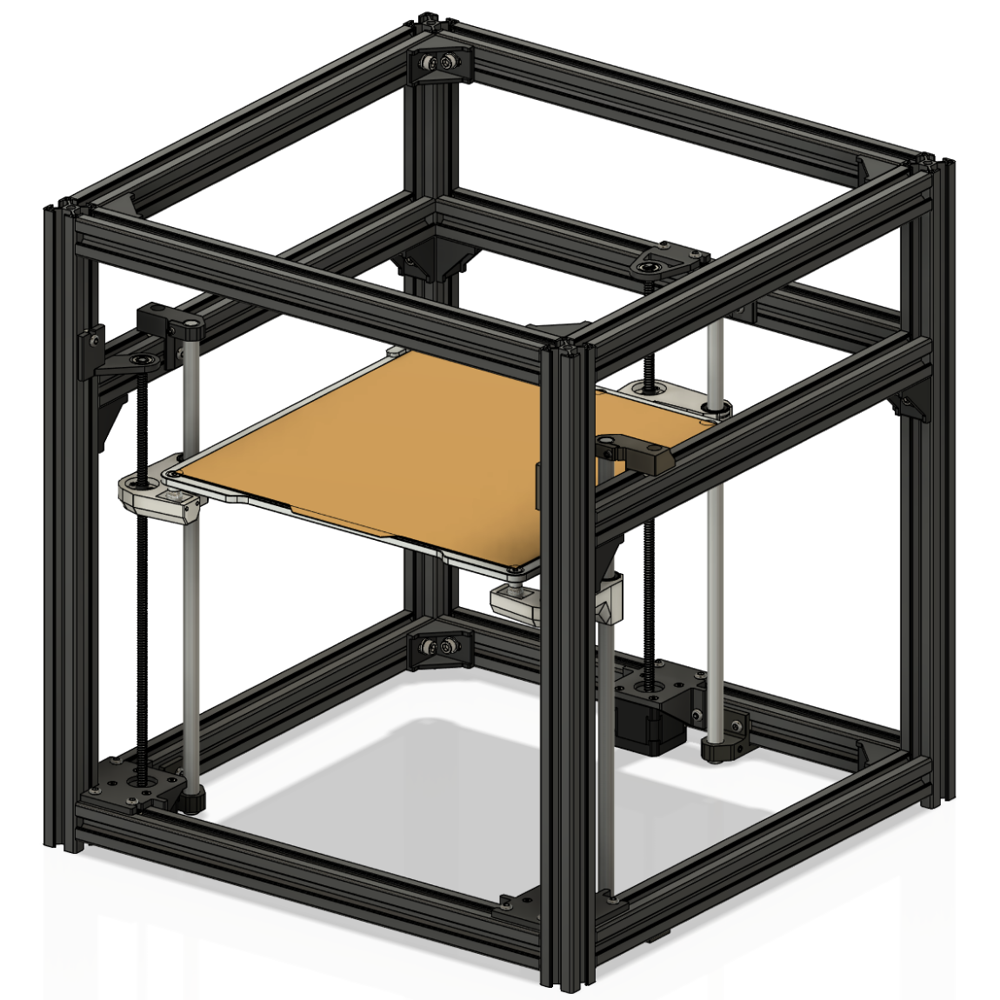

# Kinematic Z Axis for Hypercube Evolution

All the necessary components to fit the RatRig bed inside a the stock Hypercube Evo frame.

  

# Configurations

As a point of reference the stock V6 setup uses Option B. If your nozzle is more forward, use Option A.

| Option A | Option B | Option C |
|  :----:  |  :----:  |  :----:  |
|  |  |  |

# Printed Parts

### Option A or B
| Part                                                  | Quantity |
| :---                                                  |  :----:  |
| Z Axis Bed Arm - Opt (A or B) - Front Left            |     1    |
| Z Axis Bed Arm - Opt (A or B) - Front Right           |     1    |
| Z Axis Bed Arm - Opt (A or B) - Rear - (60mm or 35mm) |     1    |
|||
| Z Axis Motor Mount - Front                            |     2    |
| Z Axis Motor Mount - Rear                             |     1    |
|||
| Z Axis Lead Screw Bearing Holder - Front Left         |     1    |
| Z Axis Lead Screw Bearing Holder - Front Right        |     1    |
| Z Axis Lead Screw Bearing Holder - Rear               |     1    |
|||
| Z Axis Linear Rod Bracket - Bottom Left - Scott3D     |     2    |
| Z Axis Linear Rod Bracket - Bottom Right - Scott3D    |     1    |
| Z Axis Linear Rod Bracket - Top Left                  |     2    |
| Z Axis Linear Rod Bracket - Top Right                 |     1    |

### Option C
| Part                                               | Quantity |
| :---                                               |  :----:  |
| Z Axis Bed Arm - Opt B - Front Left                |     2    |
| Z Axis Bed Arm - Opt B - Front Right               |     1    |
|||
| Z Axis Motor Mount - Rear                          |     3    |
|||
| Z Axis Lead Screw Bearing Holder - Rear            |     3    |
|||
| Z Axis Linear Rod Bracket - Bottom Left - Scott3D  |     2    |
| Z Axis Linear Rod Bracket - Bottom Right - Scott3D |     1    |
| Z Axis Linear Rod Bracket - Top Left               |     2    |
| Z Axis Linear Rod Bracket - Top Right              |     1    |

# BOM
### Note
A majority of these parts are going to be from RatRig because this bed system is more of a adaptation. 

This bed configuration works for the stock V6 setup. Depending on your nozzle height you may need to change the length of the M5 screws and spacers.

**You will have to find out the length of your lead screw yourself. I recommend cutting a 350mm to length**

### Bed
| Part                      | Quantity | Links |
| :---                      |  :----:  | :---  |
| PEI Sheet                 |     1    | [RatRig US](https://us.ratrig.com/catalog/product/view/id/1799/s/flexplate-pro-set-black-textured-pei-310-x-310-mm-double-sided/category/176/), [RatRig INTL](https://ratrig.com/catalog/product/view/id/1799/s/flexplate-pro-set-black-textured-pei-310-x-310-mm-double-sided/category/2/) |
| Bed Plate - 329x329x6mm   |     1    | [RatRig US](https://us.ratrig.com/bed-plate-cast-tooling-plate-pre-machined-multiple-sizes.html), [RatRig INTL](https://ratrig.com/bed-plate-cast-tooling-plate-pre-machined-multiple-sizes.html) |
| Heater Pad - 280x280mm    |     1    | [RatRig US](https://us.ratrig.com/keenovo-heater-pad-and-ssr-relays-multiple-sizes-configurations.html), [RatRig INTL](https://ratrig.com/keenovo-heater-pad-and-ssr-relays-multiple-sizes-configurations.html) |
| Countersink Screw - M5x16 |     4    | [RatRig US](https://us.ratrig.com/countersink-screw-m5-single-length-16mm.html), [RatRig INTL](https://ratrig.com/countersink-screw-m5-single-length-16mm.html) |
| Spacer - 6mm              |     3    | [RatRig US](https://us.ratrig.com/aluminium-spacer-6mm.html), [RatRig INTL](https://ratrig.com/aluminium-spacer-6mm.html) |
| Steel Ball - M5           |     3    | [RatRig US](https://us.ratrig.com/steel-ball-12mm-threaded-m5.html), [RatRig INTL](https://ratrig.com/steel-ball-12mm-threaded-m5.html) |

### Bed Arms

| Part                  | Quantity | Links |
| :---                  |  :----:  | :---  |
| LM12UU                |     3    | |
| Leadscrew Nut - Pom   |     3    | [Amazon](https://a.co/d/7AfcsfY) |
| Magnet - 20x10x5mm    |     3    | [RatRig US](https://us.ratrig.com/magnet-20-x-10-x-5mm-two-hole-m3-countersink-screws.html), [RatRig INTL](https://ratrig.com/magnet-20-x-10-x-5mm-two-hole-m3-countersink-screws.html) |
| 3mm Dowel Pins - 35mm |   6 or 4 | [RatRig US](https://us.ratrig.com/dowel-pin-3-0mm-x-35-0mm.html), [RatRig INTL](https://ratrig.com/dowel-pin-3-0mm-x-35-0mm.html)|
| 3mm Dowel Pins - 65mm |     2    | [McMaster](https://www.mcmaster.com/91585A495/) |
| M3 Countersink - 12mm |     6    | [Amazon](https://a.co/d/gf60rxQ) |
| M3 Cap Head - 12 mm   |     6    | [Amazon](https://a.co/d/0atVqlW) |
| M3 Hex Locking Nut    |     6    | [Amazon](https://a.co/d/0cLNHXG), [RatRig US](https://us.ratrig.com/hex-locking-nut-m3-black.html), [RatRig INTL](https://ratrig.com/hex-locking-nut-m3-black.html) |
| M3 Hex Nut            |     6    | |

### Motion

You can use Scott3D's linear rod brackets and the stock 400mm linear rods.

| Part                        | Quantity | Links |
| :---                        |  :----:  | :---  |
| NEMA 17 Stepper Motor       |     3    | [Amazon](https://a.co/d/fHqu4pj) |
| F688ZZ Flanged - 8x16x5mm   |     3    | [RatRig US](https://us.ratrig.com/ball-bearing-f688zz.html), [RatRig INTL](https://ratrig.com/ball-bearing-f688zz.html) |
| T8*8 Lead Screw - 350mm     |     3    | [Amazon](https://a.co/d/1wLjaOY) |
| Linear Rod - 385mm          |     3    | |
| Coupler - 5x8mm             |     3    | [Amazon](https://a.co/d/5FWJcxl) |
| M3 Heat Inserts             |     6    | |
| M3 Cap Head - 25 mm         |     6    | [Amazon](https://a.co/d/0atVqlW) |
| M3 Countersink - 12mm       |     12   | [Amazon](https://a.co/d/gf60rxQ) |
| M5 Button Head Screw - 10mm |     32   | [Amazon](https://a.co/d/6TOt8Vt) |
| M5 3030 T-Nut               |     32   | [Amazon](https://a.co/d/0dSIwOj) |
